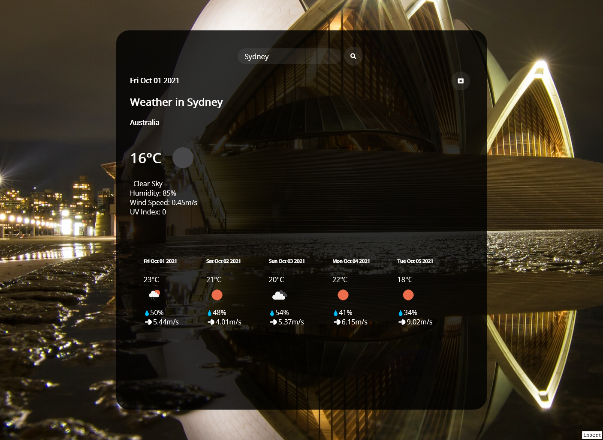

# Jupiter Weather Dashboard
  Welcome to the Jupiter Weather Dashboard!
# Deployed Link
https://bashar147258.github.io/WeatherDashboard/
# Demonstation

![Madrid[(./Assets/Sample/Screenshot_2021-10-01 Jupiter Weather-Madrid.png)
# Additional Features
* The back ground will change to the city selected
* When a city is selected, the current weather information aswell as the 5 day information will be posted
* Has its own Favicon
# Built with
HTML, CSS, Javascript, Openweather API (weather & Onecall), Intl display names, Source.unsplash, font.awesome, googlefonts 

